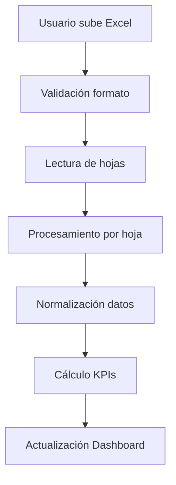

# 📊 Sistema Immermex Dashboard - Documentación Técnica

## 🎯 Descripción General

El **Immermex Dashboard** es un sistema web moderno para el análisis financiero y operativo de la empresa Immermex. Proporciona visualizaciones interactivas de KPIs, gráficos dinámicos y análisis de datos en tiempo real basados en archivos Excel mensuales.

## 🌐 Arquitectura del Sistema

### Frontend (React + TypeScript)
- **Framework**: React 18 con TypeScript
- **Build Tool**: Vite
- **Styling**: Tailwind CSS
- **Charts**: Recharts
- **Icons**: Lucide React
- **Deployment**: GitHub Pages

### Backend (FastAPI + Python)
- **Framework**: FastAPI
- **Data Processing**: Pandas
- **File Handling**: Excel (.xlsx, .xls)
- **CORS**: Configurado para múltiples orígenes
- **Deployment**: Vercel

## 📁 Estructura del Proyecto

```
immermex-dashboard/
├── frontend/                    # Aplicación React
│   ├── src/
│   │   ├── components/         # Componentes React
│   │   │   ├── Charts/        # Gráficos especializados
│   │   │   ├── ui/            # Componentes UI base
│   │   │   ├── Dashboard.tsx  # Componente principal
│   │   │   ├── FileUpload.tsx # Subida de archivos
│   │   │   └── Filters.tsx    # Filtros dinámicos
│   │   ├── services/          # Servicios API
│   │   ├── types/             # Tipos TypeScript
│   │   └── App.tsx            # Punto de entrada
│   ├── package.json           # Dependencias Node.js
│   └── vite.config.ts         # Configuración Vite
├── backend/                    # API FastAPI
│   ├── simple_main.py         # Servidor principal
│   ├── data_processor.py      # Procesador de datos
│   ├── models.py              # Modelos Pydantic
│   ├── database.py            # Configuración BD
│   └── requirements.txt       # Dependencias Python
├── docs/                      # Documentación
└── README.md                  # Documentación principal
```

## 🔧 Funcionalidades Principales

### 1. **Dashboard de KPIs**
- **Facturación Total**: Suma de todas las facturas del período
- **Cobranza Total**: Total de cobros realizados
- **% Cobrado**: Porcentaje de cobranza sobre facturación
- **Anticipos**: Total de anticipos recibidos
- **Total Facturas**: Número de facturas emitidas
- **Clientes Únicos**: Cantidad de clientes únicos
- **Rotación Inventario**: Veces que se rotó el inventario
- **Días CxC Ajustado**: Días promedio de cobro
- **Ciclo de Efectivo**: Inventario + Cuentas por Cobrar

### 2. **Gráficos Interactivos**
- **Aging de Cartera**: Distribución por rangos de días (0-30, 31-60, 61-90, 90+)
- **Top Clientes**: Ranking por facturación
- **Consumo por Material**: Análisis de materiales por kg

### 3. **Subida de Archivos**
- **Formatos Soportados**: Excel (.xlsx, .xls)
- **Hojas Procesadas**:
  - `facturacion`: Datos de facturación
  - `cobranza`: Datos de cobranza
  - `cfdi relacionados`: Anticipos y notas de crédito
  - `1-14 sep` (o similar): Datos de pedidos por período

### 4. **Filtros Dinámicos**
- **Por Fecha**: Rango de fechas personalizable
- **Por Cliente**: Filtro específico de cliente
- **Por Agente**: Filtro por agente comercial
- **Por Material**: Filtro por tipo de material
- **Por Mes/Año**: Filtros temporales

## 🔄 Flujo de Procesamiento de Datos

### 1. **Carga de Archivo**


### 2. **Procesamiento por Hoja**

#### **Hoja 'facturacion'**
- Mapeo de columnas a estructura estándar
- Normalización de fechas y importes
- Cálculo de campos derivados (mes, año)
- Limpieza de UUIDs y folios

#### **Hoja 'cobranza'**
- Relación con facturas por UUID/folio
- Agregación de importes por factura
- Cálculo de fechas de cobro

#### **Hoja 'cfdi relacionados'**
- Filtrado de anticipos
- Agregación por UUID de factura
- Cálculo de importes de anticipos

#### **Hoja de Pedidos (ej: '1-14 sep')**
- Procesamiento de datos de pedidos
- Cálculo de consumos por material
- Análisis de rentabilidad

### 3. **Cálculo de KPIs**

```python
# Ejemplo de cálculo de KPIs principales
facturacion_total = sum(facturas['monto_total'])
cobranza_total = sum(cobranzas_relacionadas['importe_pagado'])
porcentaje_cobrado = (cobranza_total / facturacion_total) * 100
aging_cartera = calcular_aging_por_dias(facturas_pendientes)
```

## 🌐 API Endpoints

### **KPIs y Datos Principales**
- `GET /api/kpis` - Obtiene KPIs principales
- `GET /api/health` - Verificación de salud del sistema

### **Gráficos**
- `GET /api/graficos/aging` - Datos para gráfico de aging
- `GET /api/graficos/top-clientes` - Datos de top clientes
- `GET /api/graficos/consumo-material` - Datos de consumo por material

### **Archivos**
- `POST /api/upload` - Subida de archivos Excel
- `GET /api/archivos` - Lista de archivos procesados

### **Análisis Detallado**
- `GET /api/analisis/pedidos` - Análisis de pedidos
- `GET /api/analisis/clientes` - Análisis de clientes
- `GET /api/analisis/materiales` - Análisis de materiales

## 🚀 Despliegue y Configuración

### **Frontend (GitHub Pages)**
```bash
# URL de producción
https://edu-maass.github.io/immermex-dashboard/
```

### **Backend (Vercel)**
```bash
# URL de API
https://immermex-dashboard.vercel.app
# Documentación API
https://immermex-dashboard.vercel.app/docs
```

### **Variables de Entorno**
```env
# Frontend
VITE_API_URL=https://immermex-dashboard.vercel.app

# Backend (Vercel)
# Configurado automáticamente por Vercel
```

## 📊 Especificaciones de Datos

### **Formato de Archivo Excel Requerido**

El sistema espera un archivo Excel con las siguientes hojas:

1. **'facturacion'**
   - Fecha de factura
   - Serie factura
   - Folio factura
   - Cliente
   - Monto neto/total
   - Saldo pendiente
   - Días crédito
   - Agente
   - UUID factura

2. **'cobranza'**
   - Fecha de pago
   - Serie/Folio pago
   - Cliente
   - Importe pagado
   - UUID factura relacionada
   - Forma de pago

3. **'cfdi relacionados'**
   - UUID CFDI
   - Cliente receptor
   - Tipo relación
   - Importe relación
   - UUID factura relacionada

4. **Hoja de Pedidos (ej: '1-14 sep')**
   - Número de pedido
   - Cliente
   - Material
   - Kg
   - Precio unitario
   - Importe sin IVA
   - Días crédito
   - Fecha factura/pago

## 🔧 Configuración Técnica

### **Dependencias Frontend**
```json
{
  "react": "^18.2.0",
  "typescript": "^5.0.0",
  "vite": "^4.4.0",
  "tailwindcss": "^3.3.0",
  "recharts": "^2.8.0",
  "lucide-react": "^0.263.0"
}
```

### **Dependencias Backend**
```txt
fastapi==0.104.1
pandas==2.1.3
openpyxl==3.1.2
python-multipart==0.0.6
uvicorn==0.24.0
```

## 🛠️ Desarrollo y Mantenimiento

### **Agregar Nuevos KPIs**
1. Modificar `backend/simple_main.py` en función `calculate_kpis()`
2. Actualizar `frontend/src/types/index.ts` con nuevos tipos
3. Agregar componente en `frontend/src/components/`

### **Agregar Nuevos Gráficos**
1. Crear componente en `frontend/src/components/Charts/`
2. Agregar endpoint en `backend/simple_main.py`
3. Integrar en `frontend/src/components/Dashboard.tsx`

### **Modificar Procesamiento de Datos**
1. Actualizar `backend/data_processor.py`
2. Ajustar mapeo de columnas según diccionario
3. Probar con archivos de ejemplo

## 📈 Métricas y Monitoreo

### **KPIs Calculados Automáticamente**
- Facturación total del período
- Eficiencia de cobranza (% cobrado)
- Análisis de aging de cartera
- Rotación de inventarios
- Consumo por material
- Análisis de clientes top

### **Validaciones de Datos**
- Formato de fechas consistente
- Importes numéricos válidos
- UUIDs únicos y válidos
- Relaciones entre facturas y cobranzas

## 🔒 Seguridad y Rendimiento

### **Seguridad**
- Validación de tipos de archivo
- Sanitización de datos de entrada
- CORS configurado para orígenes específicos
- Manejo de errores robusto

### **Rendimiento**
- Procesamiento asíncrono de archivos
- Caché de datos en memoria
- Optimización de consultas
- Compresión de respuestas

## 📞 Soporte y Contacto

Para soporte técnico o consultas sobre el sistema:
- **Desarrollador**: Eduardo Maass
- **Repositorio**: https://github.com/edu-maass/immermex-dashboard
- **Dashboard**: https://edu-maass.github.io/immermex-dashboard/

---

*Documentación generada automáticamente - Sistema Immermex Dashboard v1.0.0*
